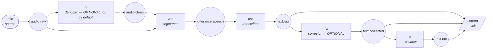

# Architecture and design decisions

Companion to [README.md](../README.md). This is the raw material for the technical
report: what the system is, why each component was chosen over the alternatives, and what
was actually measured.

Development machine: **Apple M1 Pro, 16 GB, macOS 15**, Python 3.12, ffmpeg 9.0.1.

---

## 1. The shape of the system

The spec's pipeline is a straight line:

```
Microphone → noise reduction → transcription → correction → translation → display
```

The implementation is **not** a straight line, because two requirements do not fit one:

1. **Stages are optional.** Noise reduction may be skipped. Correction may be skipped, in
   which case the fused stage repairs the errors in the same call that translates.
2. **One stage's output feeds several consumers at once.** Corrected English goes to the
   translator *and* straight to the display, simultaneously — the student should see the
   corrected English immediately, not after the translation finishes.

A hard-coded chain cannot express either without conditionals threaded through every
stage. So the system is a **graph of nodes connected by named topics**, declared in a
config file.



Read the fan-out off that diagram: `text.corrected` has **two** subscribers, `vi` and
`screen`. Read the optionality off it too — delete `nr` and point `asr` at `audio.raw`.

### Why a bus, and why per-subscriber queues

`livesub/core/bus.py`. Each subscriber gets **its own queue**. This is the single most
important implementation decision in the project.

With one shared queue per topic, the translator and the display would compete for events,
and the display would be stuck behind whatever the translator was doing — which, on a
local LLM, is about a second per line. The corrected English would appear on screen *at
the same time as its translation*, and the whole point of showing English early would be
lost. With a queue each, the display paints the instant the correction exists.

This is enforced by a test, not by hope: `tests/test_bus.py` asserts that a display
consuming a topic finishes all five lines while a 100 ms-per-line translator on the same
topic is still on its first, and `tests/test_graph_wiring.py` repeats the check through
a real graph with a deliberately slowed translator.

Backpressure is chosen per subscription mode, and the difference is not cosmetic:

| Topic / payload | Mode | Why |
| --- | --- | --- |
| `audio.*` (`AudioFrame`) | **live** (drop oldest) | Live capture cannot be slowed down. When a stage falls behind, the choice is to lose stale audio or grow memory without bound. Drops are counted and reported, never hidden. |
| `utterance.*` (`Utterance`) | **blocking** | An utterance is a complete speech event. Losing one silently means losing a subtitle line. |
| `text.*` (`TextFrame`) | **blocking** | Sentences are rare and precious. Delaying one beats losing it, and blocking propagates backpressure upstream where it belongs. |
| `audio.*` **offline** | blocking | Set by `bench` when not pacing at wall-clock speed. A file outruns the ASR instantly, and dropping frames would corrupt the *word error rate*, not just the latency. A file can wait. |

### Why one frame type for all text

```python
TextFrame(segment_id, revision, lang, text, is_final, lineage)
```

Every text topic carries the same type, so **any text stage can consume any text topic**.
That single decision is what makes the correction stage genuinely optional: a translator
wired to `text.raw` instead of `text.corrected` is a valid graph, with no code change and
no conditional anywhere.

Which stage produced a frame is visible from the **topic it was published to**, not from a
field inside the frame. Topic names are set in config; the pipeline has no opinion on what
the text means — only modules do.

`segment_id` + `revision` is the incremental-display mechanism. A sink replaces the line
whose `segment_id` matches when a higher `revision` arrives and leaves every other line
untouched — the spec's "correct the relevant word or sentence without unnecessarily
disrupting the rest of the live display". `revision` is assigned by the bus at publish
time; no module ever sets it.

### Independence, concretely

Every module package (`input`, `denoise`, `segment`, `transcribe`, `correct`, `translate`,
`sink`) imports from `livesub.core` and nothing else inside `livesub`. All modules share
one base class (`Module`) and declare their interfaces through **port type annotations**
rather than role-specific ABCs — so what a node does is visible from the types it reads
and writes, not from its position in a class hierarchy. Only `core/graph.py` instantiates
modules together, and it does so through a registry of dotted-path strings — so `import
livesub` never pulls in MLX, torch, or an HTTP client, and a missing optional dependency
surfaces when you select that implementation, as an instruction:

```
transcribe implementation 'mlx_whisper' needs a package that is not installed: No module
named 'mlx_whisper'
  try: .venv/bin/pip install -r requirements-mlx.txt
```

---

## 2. Engineering decisions

### 2.1 Audio capture

**Selected: `sounddevice` (PortAudio) for the microphone; ffmpeg for everything else.**

| Option | Verdict |
| --- | --- |
| `sounddevice` callback | **Chosen for live mic.** CoreAudio buffers arrive directly; one buffer period (20 ms) of latency, no subprocess. |
| ffmpeg `avfoundation` | **Chosen for everything else.** One adapter covers files, HLS/RTSP/HTTP URLs, and capture devices; ffmpeg already solves demuxing, decoding, downmix and resampling. Rejected for the microphone: an extra process and its internal queueing for no benefit. |
| PyAudio | Rejected. Same PortAudio underneath, less maintained, worse callback ergonomics. |
| macOS `AVAudioEngine` via PyObjC | Rejected. Marginally lower latency, macOS-only, and far more code for a prototype the group must all understand. |

Both paths emit **16 kHz mono float32 in 20 ms frames**, so no downstream stage can tell a
microphone from a video file. That is the answer to the spec's "media and data
formats" question: normalisation happens once, in the input module.

Resampling uses `scipy.signal.resample_poly` (48 kHz devices → 16 kHz), not slicing —
naive decimation aliases higher formants down into the speech band and costs accuracy.

**Microphone choice for the demo.** The built-in MacBook microphone is adequate at
lecture-desk distance and needs no setup, but it is omnidirectional and picks up the whole
room. A wireless lapel or a USB cardioid on the lecturer is substantially better at the
back of a classroom, because the improvement comes from a better SNR *at the source*,
which no amount of downstream noise reduction can match. The system supports either
without code changes; `livesub devices` lists what is attached.

**System audio.** A virtual loopback device (Background Music, or BlackHole) appears as an
ordinary input, which is how a video call or a playing video is captioned:

```bash
livesub run -c config/video.toml --source "Background Music" --device
```

### 2.2 Noise handling

**Selected: none. The stage is built, measured, and then switched off — because the
measurement says it makes accuracy worse.**

This is the most useful negative result in the project, and it was not the expected one.
The noise module was built first and enabled by default; the word-error-rate sweep below
is what changed the decision.

| Option | Added latency | Verdict |
| --- | --- | --- |
| **none** (no denoise node) | **0 ms** | **Chosen.** Lowest WER at every SNR tested. |
| `passthrough` | 0 ms | Identical behaviour, kept as an explicit node when a wiring wants the slot filled. |
| `highpass_gate` | 0 ms | 80 Hz high-pass + hysteretic noise gate. Sound design for ventilation rumble and fan hum, and roughly neutral on babble — but never better than nothing. |
| `spectral` | 20 ms | Own streaming STFT gate: 40 ms sqrt-Hann window, 20 ms hop, per-bin adaptive noise floor with a fast-down/slow-up follower. Best-sounding to a human, **worst for the ASR**. |
| `noisereduce` 3.0.3 | 480 ms | The well-known reference implementation, designed for whole signals. Offline comparison only; 480 ms of buffering is a sixth of the entire latency budget. |
| DeepFilterNet3 | ~80 ms | Predicts a complex filter per bin rather than one gain per band, so it is genuinely better on non-stationary noise. Untested here (needs torch); the most promising thing to try next, since its artefacts are unlike spectral subtraction's. |
| Krisp | — | Rejected: commercial SDK and licence cost. |

#### The measurement that decided it

Word error rate through the real ASR, clean speech mixed with the synthetic classroom
babble bed at four SNRs. 110 reference words. ASR only, no LLM, so the numbers isolate the
noise stage:

| denoise | clean | +10 dB | +5 dB | 0 dB |
| --- | --- | --- | --- | --- |
| **none** | **0.00%** | **7.27%** | **19.09%** | 42.73% |
| `spectral` (os 1.5, floor 0.10) | 0.91% | 10.91% | 34.55% | 60.91% |
| `spectral` (os 1.0, floor 0.20) | 0.91% | 23.64% | 20.00% | 46.36% |
| `spectral` (os 0.7, floor 0.30) | 0.00% | 22.73% | 20.91% | 45.45% |
| `spectral` (os 0.5, floor 0.45) | 0.00% | 10.00% | 21.82% | 45.45% |
| `highpass_gate` | 0.00% | 8.18% | 20.00% | **41.82%** |

**No denoiser setting beat no denoising at any SNR.** The default spectral setting nearly
doubled WER at +5 dB (19.1% → 34.6%), and the damage was almost entirely *deletions* — 11
rose to 28. It was removing speech, not noise. Only `highpass_gate` at 0 dB edges ahead,
by 0.9 points, which is within the noise of a 110-word sample.

Compare that with the signal-level measurement, which looks like a mild success:

| impl | declared latency | measured lag | speed | resid vs clean |
| --- | --- | --- | --- | --- |
| (noisy input) | — | — | — | 6.1 dB |
| `passthrough` | 0 ms | 0 ms | 31634× | 6.1 dB |
| `highpass_gate` | 0 ms | 0 ms | 695× | −0.0 dB |
| `spectral` | 20 ms | **20 ms** | 635× | **6.4 dB** |
| `noisereduce` | 480 ms | 460 ms | 48× | 2.0 dB |

The spectral gate *does* raise SNR against the clean reference, by 0.3 dB. It still makes
transcription worse. The lesson is that SNR is a proxy for a human listener, not for an
ASR, and optimising it was optimising the wrong thing.

#### Why

Whisper was trained on hundreds of thousands of hours of noisy real-world audio, including
overlapping background speech. It is already robust to babble. Spectral subtraction
removes some of that noise but introduces artefacts — musical noise, suppressed
consonants, gated word tails — that are *unlike anything in the training distribution*.
Trading familiar noise for unfamiliar distortion is a bad trade for a learned model, even
though it sounds cleaner to a person.

This also explains the shape of the errors: consonants are low-energy and broadband, so a
per-bin gate attenuates them first, and the model deletes words rather than mis-hearing
them.

#### What this means practically

* The noise stage ships, is fully implemented, is CLI-testable, and is **off by default**.
  `config/with_denoise.toml` puts it back for anyone who wants to re-run the comparison.
* Better microphone placement is worth far more than any downstream processing, because it
  improves SNR *at the source* without introducing artefacts.
* DeepFilterNet3 is the one option that might still win, since deep filtering distorts
  speech differently from spectral subtraction. It is registered and ready to test.

#### How noise conditions are made reproducible

"We tried it in a noisy room" is not a measurement — a microphone cannot reproduce the
same conditions twice. A known babble bed (three overlapping synthetic voices plus brown
noise) is mixed into clean speech at an exact SNR, so every row above ran on
byte-identical audio:

```bash
python -m livesub.denoise mix-noise --speech a.wav --noise b.wav --snr 5 --out noisy.wav
python -m livesub.denoise compare --speech assets/lecture.wav --noise assets/classroom_noise.wav --snr 5
livesub bench -c config/with_denoise.toml --in assets/lecture.wav \
    --reference assets/lecture.txt --noise assets/classroom_noise.wav --snr 5
```

#### Two implementation details worth keeping

Even though the stage is off, these were needed to make the comparison trustworthy.

*Square-root Hann on both analysis and synthesis.* Their product is a periodic Hann, which
sums to exactly 1.0 at 50% overlap, so a unit gain reconstructs the input sample for
sample. A full Hann on both sides — the obvious thing to write — sums to 0.5·(1+cos²) and
imposes a 3 dB ripple at the hop rate on everything passing through, whether or not any
noise is being removed. Without this the denoiser would have been penalised for a bug
rather than for its actual behaviour.

*Delay compensation before comparing.* Every denoiser shifts the signal. Subtracting an
unaligned output from its source measures the delay, not the distortion, and made the
first comparison run report that every denoiser was catastrophic. `core/audioutil.align`
cross-correlates and removes the lag first; the "measured lag" column above exists to
confirm it matches each implementation's declared latency.

### 2.3 Transcription

**Selected: `mlx-whisper` 0.4.3 with `whisper-small.en`.**

| Option | Verdict |
| --- | --- |
| **`mlx-whisper` 0.4.3** (chosen) | The only local Whisper runtime that uses the M1 GPU. Apple's MLX targets Metal with unified memory, so there are no host↔device copies. |
| `faster-whisper` 1.2.1 | The usual recommendation, and **wrong for this hardware**: it runs on CTranslate2, which has no Metal backend, so on Apple Silicon it is CPU-only and leaves the GPU idle. Kept as the portable fallback for non-Apple machines. |
| `openai-whisper` (reference) | Rejected: slowest of the three, no quantisation. |
| Deepgram Nova-3 streaming | Strong option — ~5.3% WER, purpose-built streaming, sub-second partials, $0.0077/min. Rejected as the *default* on privacy (lecture audio leaves the room) and on the demo depending on classroom wifi. Adapter is included. |
| OpenAI `gpt-4o-transcribe` | ~$0.006/min, good accuracy, but batch-oriented; same privacy and network objections. Adapter included. |
| macOS `SFSpeechRecognizer` | Rejected: hard 1-minute utterance limit and inconsistent on-device availability. |
| Zoom/Teams live captions | Rejected: only works inside that platform, and the spec asks for a system, not a setting. |

**Model size on 16 GB.** `whisper-small.en` (~0.5 GB) leaves room for the 4-bit Qwen3
(~2.3 GB) used by correction. `distil-large-v3` is more accurate and still viable;
`large-v3` is not, once the LLM is resident too.

Whisper-specific care, each of which fixed an observed failure:

* `condition_on_previous_text=False`. Whisper's default feeds its own prior output back as
  context; on a live stream that turns one bad transcription into a run of them and is the
  main cause of the "repeat until the clip ends" failure.
* Utterances under 300 ms are never sent. Whisper pads everything to a 30 s window
  internally and will invent a sentence from a cough.
* A hallucination filter drops the stock phrases Whisper emits for silence ("Thank you.",
  "you", subtitle-site credits) and single-token loops, which otherwise appear as
  subtitles during every pause.

### 2.4 Segmentation (pipeline node)

The segmenter is a dedicated node (`vad` in the default config) that sits between the
audio stream and the transcriber. It consumes `AudioFrame` and emits `Utterance` — a
variable-length speech region ready to transcribe. The transcriber receives complete
utterances and calls its model once per utterance, with no knowledge of how the audio was
chunked. This separation of concerns means segmenter and transcriber can be swapped
independently: a different VAD algorithm is one `impl =` change.

The default is an adaptive energy + spectral-flatness detector (`livesub/segment/energy.py`)
with **no extra dependency**. Absolute energy thresholds fail in a classroom because level
depends on distance from the microphone; this tracks the noise floor and decides on the
*ratio*, and requires spectral peakiness as well as loudness so door slams and keyboard
clatter do not trigger it. Silero VAD is available (`impl = "silero"`) and is better
when the background is itself speech — but it needs onnxruntime or torch.

**A bug worth recording, because it is the kind that hides.** The initial silence
threshold was 350 ms. Measured on the test fixture, the longest gap between sentences is
**240 ms** — so the threshold never fired, *every* utterance fell through to the 8-second
length cap, and Whisper was handed audio sliced mid-word. The output looked plausible and
was wrong:

> "A neural network is made of **a neural network.**" … "The result is that the neuron **is not a**"

Two changes fixed it, and both are in `livesub/segment/base.py`:

* silence threshold **220 ms** — reliably above intra-phrase gaps (~100–150 ms), reliably
  below inter-sentence ones;
* when the length cap *is* hit, cut at the **quietest point** in a 700 ms search window
  rather than at an arbitrary sample, and carry the audio after the cut into the next
  utterance. Half a word is precisely what makes Whisper invent the other half.

After the fix, the same 36 s fixture segments into 10 utterances matching its 10 sentences,
and transcribes with 0.91% WER. `tests/test_modules.py` guards this.

### 2.5 Correction

**Selected: local `mlx-lm` 0.31.3 with `Qwen3-4B-Instruct-2507-4bit`.**

| Option | Verdict |
| --- | --- |
| **Qwen3-4B-Instruct-2507 4-bit, local** (chosen) | ~2.3 GB, fits alongside Whisper on 16 GB, strong at both Vietnamese and Chinese, runs offline, no key, no per-minute cost. |
| `rules` glossary (also shipped) | Zero latency, no model, and fixes the course-specific jargon that is most of what an ASR gets wrong in a *particular* lecture. Useful in front of the LLM, and a legitimate standalone choice. |
| `ollama` server (also shipped) | Same class of model (Qwen 4B) served by an Ollama server instead of in-process MLX. Slower per call (~1–3 s on the same hardware) but runs on any OS and any GPU Ollama supports, shares one loaded model across the corrector and translator, and survives pipeline restarts without reloading. The portability path. |
| Cloud LLM (Claude/GPT) | Better correction, but adds network latency, per-token cost, and sends lecture audio transcripts off the machine. Adapter included, off by default. |
| A *thinking* model | Rejected outright. Reasoning models emit hundreds of tokens before the answer; the "Instruct-2507" variants are the non-thinking ones and are the only viable class here. |

Guards that matter more than the prompt:

* **Only finals are corrected.** A partial line is incomplete by definition; asking a model
  to fix half a sentence makes it invent the ending.
* **Implausible rewrites are rejected.** If the correction shares under 40% of its words
  with the original, the original is kept and the rejection is counted. A small quantised
  model occasionally returns a fluent sentence with little relation to the input; for a
  live subtitle an uncorrected true line beats a confident false one.
* **Conservative prompt.** The model is told to change only what is clearly wrong. An LLM
  asked to "improve" a transcript rewrites correct sentences into different correct
  sentences, which on screen reads as the subtitle flickering — and destroys the value of
  showing the original English at all.
* **A bare answer is accepted.** Asked for `{"translation": "..."}`, an instruction-tuned
  model very often just answers with the translation. Two-field prompts get JSON reliably
  because the structure is load-bearing; one-field prompts frequently do not. Since the
  bare answer *is* the value requested, it is accepted rather than discarded and
  re-prompted at the cost of another full generation.

Measured on ten lines containing realistic Whisper errors:

```
- good morning everyone and welcome back to the coarse
+ good morning everyone and welcome back to the course             (2270 ms, cold)
- grade ee ent dissent then adjusts every weight to make the loss smaller
+ gradient descent then adjusts every weight to make the loss smaller  (972 ms)
- this process repeats for many eepocks until the model converges
+ this process repeats for many epochs until the model converges   (983 ms)

10 lines, 7 changed; p50 1001 ms, p95 1072 ms
```

### 2.6 Translation

**Selected: the same local model, with behaviour determined by which topic it subscribes to.**

This is where the optional-correction requirement becomes real behaviour rather than
permissive wiring. The translator node can be wired in two ways:

* subscribed to `text.corrected` → translate faithfully; the English is already repaired.
* subscribed to `text.raw` (no correction stage) → use a **fused** stage instead
  (`fused_ollama`, the portable default), which **repairs while translating** and returns
  both a corrected English frame and a translated frame from one call, so the display
  still shows corrected English even though no correction stage exists anywhere in the
  graph.

The second mode is not a fallback. Translating from uncorrected text and repairing
separately are different operations: a translator that can see the target language often
resolves an English homophone a monolingual corrector cannot, because only one reading
survives translation. It also costs one model round trip instead of two.

That one-call arrangement is shipped twice more as dedicated implementations: `fused_llm`
on MLX, and the Ollama fused stage above, which subclasses the Ollama translator for its
engine plumbing. The Ollama translator itself used to carry this behaviour behind a
`repair_mode` flag; it was removed because the `corrected` port sits silent unless the
flag is set, which reads as a broken pipeline more often than as an option -- one job per
implementation, and the MLX and cloud translators (whose graphs and tests rely on the
flag) keep it. All of them publish to their extra topics via `[node.out]` with named
ports. The spec explicitly permits combining the two steps; §3 measures whether it
is worth it.

| Option | Verdict |
| --- | --- |
| Same LLM, wiring-driven behaviour (**chosen**) | One model resident instead of two; handles both wirings; good on `vi` and `zh`. |
| Same LLM via the `ollama` server | Identical behaviour, portability instead of speed — see the correction table above. |
| Separate local NMT (Argos/OPUS-MT) | Faster per line and smaller, but cannot repair errors, has no discourse context, and needs a separate model per language pair. |
| DeepL / Google Translate API | Better literary quality, but network latency, cost, and transcripts leaving the machine. |
| macOS Translate framework | On-device and free, but no API for arbitrary context and no error repair. |

Adding a language is adding a node, not changing code — `config/bilingual.toml` runs two
translators on the same `text.corrected` topic, so one correction pass feeds both
Vietnamese and Chinese concurrently.

### 2.7 User interface

**Selected for this deliverable: a terminal display plus a WebSocket broadcast.**

`stdout_pretty` implements the incremental-correction requirement directly — it keeps one
block per `segment_id` and repaints only that block using ANSI cursor movement, so earlier
lines never move and scrollback survives. It shows the measured end-to-end delay per line,
which is what the live demonstration needs to display.

The GUI is deliberately **not** built into the backend. `websocket_server` broadcasts every
event, and the replace rule a client implements is one sentence long, so a browser page, a
native macOS app, or OBS can all attach to the same stream.

| Option | Verdict |
| --- | --- |
| Terminal + WebSocket (**chosen for the backend**) | Demonstrable now, and does not commit the UI to a framework. Late joiners get the last 20 events replayed. |
| SwiftUI / native macOS | The best final demo — a floating always-on-top caption window is exactly right for a lecture. Attaches over the same WebSocket; no backend change. |
| Python GUI (Tkinter/PyQt) | Cross-platform and quick, but a repainting subtitle overlay is precisely the thing Tkinter is worst at. |
| Browser page | Easiest to style and to screenshot for the report; the WebSocket schema is designed for it. |

Slow clients are dropped rather than allowed to apply backpressure — a browser tab that
stops reading must never stall the pipeline feeding everyone else.

---

## 3. Measured results

36 s synthesised lecture (10 sentences, 110 reference words), replayed at wall-clock speed
through the full pipeline on an M1 Pro. WER is computed after normalising case,
punctuation and small numerals, so "Chapter 4" vs "chapter four" is not counted as an
error.

### 3.1 Accuracy and latency, clean audio

| Wiring | LLM calls / line | displayed WER | raw ASR WER | raw EN p50 | translated p50 |
| --- | --- | --- | --- | --- | --- |
| `default` (correct + translate as separate nodes) | 2 | **0.00%** | 0.91% | 234 ms | 2758 ms |
| `fused` (one node, one call, two outputs) | 1 | **0.00%** | 0.91% | — | **2249 ms** |
| `no_correct` (translator repairs while translating) | 1 | **0.00%** | 0.91% | — | **2183 ms** |

All three reach the same accuracy on this fixture, and the two single-call wirings are
~500-575 ms faster. On clean audio the separate correction node buys nothing measurable
and costs half a second — the fixture simply is not hard enough for correction quality to
separate them. The split wiring keeps one advantage the table cannot show: corrected
English reaches the display at ~1.65 s, before the translation exists, because they are
separate topics with separate subscribers. In the fused wirings both appear together.

Per-stage service time, `default`:

| stage | n | p50 | p95 |
| --- | --- | --- | --- |
| `nr` (spectral denoise) | 1840 | 0.1 ms | 0.4 ms |
| `asr` (whisper-small.en, MLX) | 100 | 272 ms | 531 ms |
| `correct_llm` (Qwen3-4B 4-bit) | 20 | 1283 ms | 1680 ms |
| `translate_llm` (Qwen3-4B 4-bit) | 10 | 1116 ms | 1275 ms |

Transcription alone runs at **11× realtime** on this hardware (36.2 s of audio in 3.29 s).
The noise stage is free at 0.1 ms. **The LLM is the entire latency budget** — the two
generations together account for ~2.4 s of the 2.76 s end-to-end figure.

The two-tier display is what makes this usable: English appears at **234 ms**, and the
corrected-and-translated revision replaces it at ~2.8 s. A student is never waiting three
seconds to see anything.

### 3.2 Under classroom babble (+5 dB SNR)

| Wiring | displayed WER | raw ASR WER | translated p50 |
| --- | --- | --- | --- |
| `default` (no denoise) | **19.09%** | 19.09% | 3800 ms |
| `with_denoise` (spectral) | 33.64% | 34.55% | 3833 ms |

Two things to report honestly here. Noise reduction makes it substantially worse (§2.2).
And **both exceed the three-second budget** at +5 dB: degraded audio produces more, shorter
utterances, so the LLM is called more often and queues behind itself.

### 3.3 Reproducing all of it

Results for every wiring are produced by:

```bash
livesub bench -c config/fused.toml     --in assets/lecture.wav --reference assets/lecture.txt
livesub bench -c config/no_correct.toml --in assets/lecture.wav --reference assets/lecture.txt
livesub bench -c config/default.toml   --in assets/lecture.wav --reference assets/lecture.txt \
    --noise assets/classroom_noise.wav --snr 5
livesub bench -c config/with_denoise.toml --in assets/lecture.wav --reference assets/lecture.txt \
    --noise assets/classroom_noise.wav --snr 5
```

Each writes a full JSON record to `results/`. See `results/*.json` for the runs recorded
during development.

---

## 4. Known limitations and failure cases

* **The synthesised fixture is not a lecture hall.** `say`-generated speech is clean,
  evenly paced, and has 240 ms sentence gaps. Real lecturers pause longer (which helps
  segmentation) but also stumble, restart sentences, and turn away from the microphone
  (which does not). The 0.00% WER above is a ceiling, not an expectation.
* **The 3-second budget is met at p50, not at p95.** The p95 for a translated line is
  ~3.1 s on clean audio. A long sentence that hits the 6 s length cap will exceed it.
* **Latency is dominated by one model.** Any accuracy improvement that adds a second LLM
  call breaks the budget. The fused wiring exists for exactly this reason.
* **Correction can make things worse.** The similarity guard rejects gross hallucinations,
  but a plausible-and-wrong homophone substitution passes it. Running with
  `--correct passthrough` is always available.
* **Babble is the hard case, and noise reduction barely helps.** Measured in §2.2: the
  spectral gate improves residual SNR by 0.3 dB against overlapping speech. A better
  microphone position is worth more than any amount of downstream processing.
* **Speaker changes are invisible.** There is no diarisation; a question from the audience
  is transcribed as though the lecturer said it.
* **No punctuation-aware re-segmentation.** An utterance is cut on silence, which does not
  always coincide with a sentence.
* **English source only.** The pipeline assumes English in; the ASR model is `.en`.
* **Memory.** Whisper-small plus the 4-bit 4B model is ~2.8 GB resident. `distil-large-v3`
  plus an 8-bit LLM will not fit comfortably in 16 GB alongside a browser.
* **The WebSocket binds to localhost.** Deliberate — a lecture transcript should not
  appear on the classroom network by accident — but it means a phone cannot attach without
  changing `host`.

---

## 5. Versions

| Component | Version | Note |
| --- | --- | --- |
| Python | 3.12.7 | dedicated venv, not the Anaconda base |
| ffmpeg | 9.0.1 | `avfoundation` for macOS devices |
| mlx-whisper | 0.4.3 | Metal GPU |
| mlx-lm | 0.31.3 | |
| Whisper model | `mlx-community/whisper-small.en-mlx` | ~0.5 GB |
| LLM | `mlx-community/Qwen3-4B-Instruct-2507-4bit` | ~2.3 GB, non-thinking |
| faster-whisper | 1.2.1 | fallback; CPU-only on Apple Silicon |
| sounddevice | 0.5.6 | PortAudio |
| noisereduce | 3.0.3 | offline comparison only |
| silero-vad | 6.2.1 | optional segmenter |
| websockets | 17.1 | subtitle broadcast |
| typer | 0.27.2 | CLIs |
